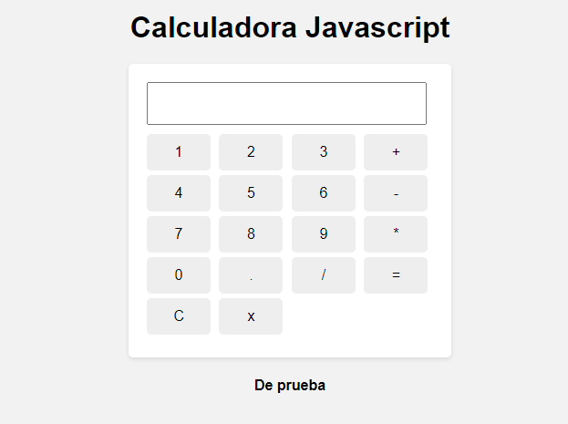

# Calculadora Web



Este proyecto es una calculadora web simple creada con HTML5, CSS3 y JavaScript. La calculadora permite realizar operaciones básicas como suma, resta, multiplicación y división.

## Descripción

La calculadora es una aplicación web que simula el funcionamiento de una calculadora física. Está diseñada con una interfaz limpia y moderna utilizando CSS3, y la lógica de la calculadora se implementa en JavaScript.

## Características

- **Operaciones básicas**: Suma, resta, multiplicación y división.
- **Interfaz moderna**: Diseño simple y fácil de usar.
- **Responsive Design**: Adaptable a diferentes tamaños de pantalla.

## Tecnologías Utilizadas

- **HTML5**: Estructura del proyecto.
- **CSS3**: Estilos y diseño visual.
- **JavaScript**: Lógica de la calculadora.

## Capturas de Pantalla


## Cómo Usar

1. Clona este repositorio en tu máquina local.
   ```bash
   git clone https://github.com/OscarCantaro/Calculadora-Javascript.git

## Estructura del Proyecto
```bash
.
├── index.html        # Archivo principal HTML
├── style.css        # Archivo de estilos CSS
├── script.js         # Archivo JavaScript con la lógica de la calculadora
└── assets/
    └── calculadora.png  # Captura de pantalla de la calculadora
